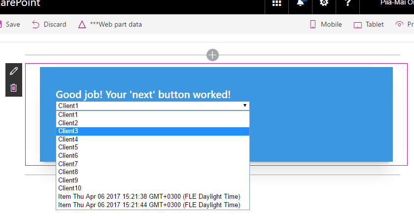

# SharePoint Multi-Step Wizard Using React and TypeScript. Tutorial 1

This tutorial covers the following:
- how to create a Spfx project using Yeoman generator
- How to create a multi-step app using react and typescript

### Building the code

```bash
git clone the repo
npm i
npm i -g gulp
gulp
```

1.	Create a SharePoint project with React using [Yeoman generator](https://dev.office.com/sharepoint/docs/spfx/web-parts/get-started/build-a-hello-world-web-part).
2.	Start the sharepoint framework in the test environment using gulp serve. It will automatically start the app in the browser at https://localhost:4321/temp/workbench.html.*3.	Structure your project. Create a folder under components for every step of your wizard. In each folder create a .tsx file like seen on the picture below. Note that the order is alphabetic, the real order of the wizard is **Main -> StepOne -> StepTwo ->  Confirm**.



4.	Yeoman automatically created an app that renders from multiPageWiz.tsx under multiPageWiz folder. As we want to make a multiple view app, we put all the views In separate tsx files and treat them as separate components, including the main.
You can replace all the code in multiPageWiz.tsx with the following:

```
import * as React from 'react';
import { IMultiPageWizProps } from './IMultiPageWizProps';

export default class SpGroup extends React.Component<IMultiPageWizProps, void> {
  public render(): JSX.Element {
    return (
      <div>
      </div>
    );
  }
}
```

Note that right now the app is a blank sheet. Don’t worry, we will fill it up.

5.	 Go to Main and replace the code with the following:

```
import * as React from 'react';
import styles from '../MultiPageWiz.module.scss';
import MultiPageWiz from '../MultiPageWiz';

export default class Main extends React.Component<any, any> {
    public render(): JSX.Element {
      return (
        <div>
           <div className={styles.helloWorld}>  
              <div className={styles.container}>
                <div className={`ms-Grid-row ms-bgColor-themeSecondary ms-fontColor-white ${styles.row}`}>
                  <span className="ms-font-xl ms-fontColor-white">
                    <b>Create a group for your client!</b>
                  </span>
                </div>
              </div>
          </div>
        </div>
      );
    }
}
```

There is still nothing rendered, because you need to render it to MultiPageWiz.tsx. Open the file and import Main (```import Main from './main/Main';```).
Then add ```<Main />``` in between the div’s.
If you save the file you can see that an image appears on the app page. This is the html that was added to Main!


6.	You have successfully rendered one component. Now, how to move on to the next? Quite obviously, you need a “Next” or a “Start” button that will take you to the next view. Create the button to Main under span with the following html:

```
<div className='ms-Grid-col ms-u-lg10 ms-u-xl8 ms-u-xlPush2 ms-u-lgPush1'>
<a href="#" className={`${styles.button}`}>
      	<span className={styles.label}>START</span>
      </a>
</div>
```

Note that this button currently takes you nowhere, because there is no method yet that will do that. But first, let’s create the second view.
6.1.	 Open StepOne.tsx and add the following code:

```
import * as React from 'react';
import styles from '../MultiPageWiz.module.scss';
import MultiPageWiz from '../MultiPageWiz';
import Main from '../main/Main';

export default class StepOne extends React.Component<any, any> {
    public render(): JSX.Element {
      return (
       <div>
          <span className="ms-font-xl ms-fontColor-white">
            <b>Good yob! Your 'start' button worked! </b>
          </span>
      </div>
      );
    }
}
```

Note that this is practically a copy-paste of the Main component, only the class names, html and imports differ a bit. **This is basically a blueprint of any component, so keep that in mind when creating next ones.**

6.2.	Go to Main and create a sort of a router. This is a method that checks where you are at the moment and chooses what to display. First, create a constructor for state that shows where you are at and has a default value of 0. Add the following code just above the render method:

```
constructor(props) {
  super(props);
  this.state = {step: 0};
}   
```

Then create a method called ```nextStep()``` that increments the state value with each click:

```
private nextStep(): void {
  this.setState({step: this.state.step + 1});
  console.log(this.state.step);
}
```

Then add the function to the ‘next’ button (```<a href="#"className={`${styles.button}`} onClick={() => this.nextStep()}>…</a>```).  Now when you click the button, nothing visible happens, but you can see in the console that each time you press the button it prints out a number incremented by 1. To bind this to the view, you must tell the main what to render. First, add the condition to the first view that is in the ```<span>```. Do it like this: ```{ this.state.step < 1 && <span>…</span> }```. To add the second view, render StepOne below the ```<span>``` like this: ```{ this.state.step == 1 && <StepOne /> }``` and don’t forget to import it. Press the next button and you should see the view change!


PS! You can add a ’back’ or ‘previous’ button by using a similar function that decrements the state value by 1. If you don’t want it to render in the first view, simply restrict it with a rule that allows rendering only if state value is larger than 0. To prohibit rendering of the ‘next’ button on the last view, just add a rule that prohibits it if the state value is larger than 2 (or allow it until state value is smaller than 3!).
